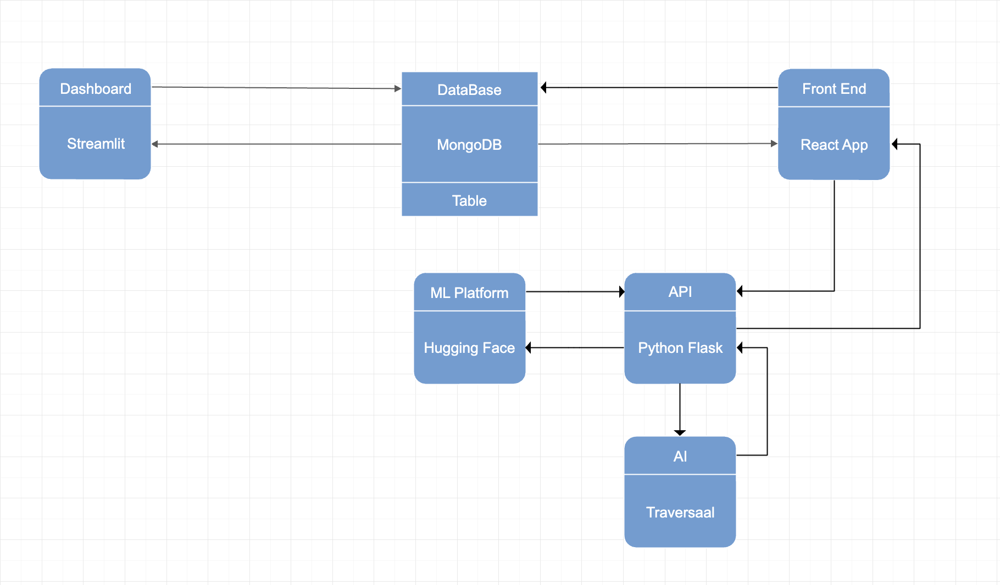

  

# EqWe Care - Because we care!

At EqWe Care, our mission is to provide equal, quality and uninterrupted health care for the deprived and distressed sections of the society. Our applications are strategically made to ensure immediate assistance to emergency patients by providing a one click consolidated summary of difficult to access historical medical reports. Additionally, we understand the inadequate care that people rely on due to lack of awareness on affordable insurance programs. So, through our platform we provide well assessed insurance programs that maximize benefits at surprisingly affordable plans. As a service provider and SaaS platform we bridge the unfortunate health care gaps.

## Methodology

There is a latency in maintaining a concise and quick one click away health record of patients. It’s always a hassle to compile older records and provide prompt care especially in unresponsive emergencies and for senior patients. Our platform uses multimedia EHRs of patients and runs them through Gen AI to convert features to descriptions. LLMs are used upon the descriptions to provide concise summarization of the records. Multimedia reports including MRI reports, lab diagnostic reports and patient vital information through csv files are pre processed and loaded on MongoDB and accessed by Intel Cloud Developer and React to develop models and build front end respectively.  Super Resolution Generative Adversarial Networks (SRGAN) to improve the resolution of MRI reports and read the descriptions more precisely. This data is used to build a real time analytics dashboard using streamlit to monitor the key indicators.This pre-processed data from multi media EHRs is then passed through GPT 3.5 to convert extracted features to descriptions. These descriptions are converted into insightful summaries by the pretrained Transformer (T5) LLM Model built on Intel Developer Cloud and deployed in Hugging Face. The fetched summaries help the frontline medical workers to provide immediate assistance and make informed decisions in cases of unresponsive emergencies and unaccompanied senior patients with limited resources of medical history. 

Using the EHR data and summaries we detect and classify the health records into acute and chronic diseases using GPT 3.5 (Gen AI). Upon detection, relevant and optimized insurance programs are suggested and links are provided for enrollment into these programs, providing and enabling quality medical care. In future, we plan to take in consideration the patient's income and current savings  information to suggest the most effective and reasonable plan. This feature will not only help the hospital administration and patients but also enable insurance firms to curate programs that can provide desperate support to the deprived populations. This move is a strategic win-win scenario for all the stakeholders involved. 

Additionally to upscale the user experience we also provide a conversational chatbot built using Traversaal AI. This feature allows easy onboarding of hospital staff and ensure 24*7support to provide accurate support with utmost precision.

## Tech Stack

**Front End:** React, Redux, TailwindCSS

**DataBase:** MongoDB

**Back End:** Intel Cloud Developer, GPT 3.5, Hugging Face

**Dashboarding:** Stringlet

**Gen AI**: GPT 3.5, Traversaal AI

**Methodology**: Transformer LLM (T5), SRGAN

## Data Architecture

  

## Application

[EqWe Care](https://linktodocumentation)

[Streamlit Dashboard](http://dashboardeqwe.eqwecare.tech/)

Our product can be used as a plug in to the existing patient management systems or we can be service providers who can build a one stop solution built using complex data intrinsic models to manage electronic administrative records of the hospitals and medical and life insurance companies. Additional features benefits include improving the patient experience by fast, optimized and personalized treatment and programs without compromising the patient record privacy. Organizations can become robust in making data driven decisions utilizing the granular and easy to infer dashboards that the solution provides. All in all this solution comes with a positive, multifold impact, both tangible and intangible.

## Key Features

1. **Streamlined Access**: EqWeCare provides seamless access to patients' EHRs, consolidating data from various sources into a unified platform. This streamlines the process for healthcare providers, saving time and improving efficiency.
2. **Comprehensive Data Analysis**: Leveraging advanced analytics tools, EqWeCare offers insights into patient health trends, medication adherence, treatment outcomes, and more. Healthcare providers can make informed decisions based on comprehensive data analysis, leading to better patient care and outcomes.
3. **Interoperability**: EqWeCare promotes interoperability by facilitating the exchange of health information between different healthcare systems and providers. This ensures continuity of care and enables collaboration among healthcare professionals involved in a patient's treatment.
4. **Security and Compliance**: EqWeCare prioritizes data security and compliance with healthcare regulations, implementing robust encryption protocols and access controls to protect patient confidentiality and privacy.
5. **Personalized Care Plans**: With access to a wealth of patient health data, healthcare providers can create personalized care plans tailored to each individual's needs and preferences. This patient-centric approach improves engagement and satisfaction while optimizing treatment outcomes.
6. **Scalability and Flexibility**: EqWeCare is designed to scale with the growing needs of healthcare organizations, offering flexibility to adapt to evolving technology and regulatory requirements.

## Conclusion

Through this solution, we believe we can touch and save lives of people and democratize medical care. In future, we would want to improve our solution by including more EHR samples of different health conditions and increasing the compliance of the model towards wider concerns. We also want to improve on curating customized insurance plans and make this feature more accessible. 

